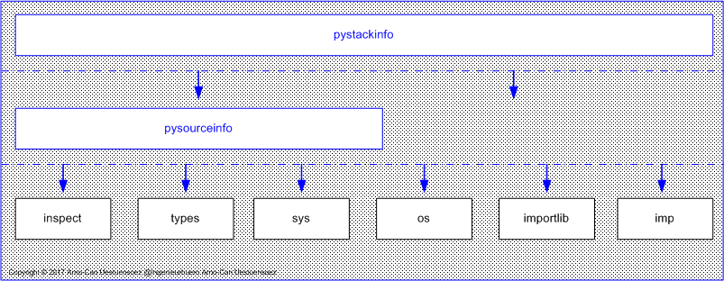
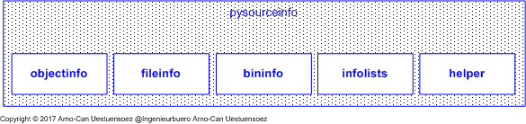

*********
Blueprint
*********

.. _REFERENCE_ARCHITECTURE:

The package *PySourceInfo* provides the display of code-location for callable Python syntax 
elements including the involved class and containment hierarchy.
The name-binding as defined by the package *PySourceInfo* targets the accurate location
of static code components.
This is based on the dynamic runtime information as provided by the Python interpreter.
The *PySourceInfo* and the related *PyStackInfo* avoid 
static data preparation [PEP3155]_ and AST based approaches e.g. by [qualname]_.
In distinction pure dynamic data gathering is proceeded, which inherently provides 
also for generic code created during runtime execution.

.. _FIGURE_ARCHITECTURE2:

   
   Figure: Callstack Information |layerswithpystackinfoblueprint_zoom| :ref:`more... <REFERENCE_ARCHITECTURE>`

.. |layerswithpystackinfoblueprint_zoom| image:: _static/zoom.png
   :alt: zoom 
   :target: _static/layers-with-pystackinfo-blueprint.png
   :width: 16

The  *PySourceInfo* focuses on basic information on files, modules,
and packages, including line numbers with moderate use of the *inspect* API.
The *PyStackInfo* package focuses on advanced control flow and runtime object location,
including *decorators*, *nested classes*, and *metaclasses*.

   
   Figure: Components |pysourceinfoblueprint_zoom| :ref:`more... <REFERENCE_ARCHITECTURE>`

.. |pysourceinfoblueprint_zoom| image:: _static/zoom.png
   :alt: zoom 
   :target: _static/layers-blueprint.png
   :width: 16

* `bininfo <bininfo.html#>`_ - information about the location of compiled runtime files
* `fileinfo <fileinfo.html#>`_ - information about the source location of callables
* `infolists <infolists.html#>`_ - lists and enumerations of source information
* `helper <helper.html#>`_ - support functions for the PYTHONPATH and the stack access
* `objectinfo <objectinfo.html#>`_ - information about the runtime location of Python syntax elements 

The package *PyStackInfo* makes extended use of the stack and type information.
This provides advanced debugging and analysis in particular for typical routines
handling large data sets where the pure debugger based analysis may encounter some limits.
Both packages require the support of *inspect*, which is guaranteed in the standard CPython,
and seems to be reliably present in *PyPy*.

The provided runtime structure information on Python sources is 
covered with basically one single type of interface[`Name-Binding <namebinding.html>`_]

   .. code-block:: python
      :linenos:
   
       def getCaller<Interface>(spos=1):
          """ Stack position: 
             spos==0 => caller(0==CallInterface) 
             spos==1 => caller(1) 
             spos==N => caller(N==level N) 
          """
          pass
   
       def getModule<Interface>(spos=1):
          pass
   
       def getpythonpath<Interface>(spos=1):
          pass

The interface gathers the information on the defined '<Interface>' from
the call stack, loaded modules, or search path *PATH*/*PYTHONPATH*/*sys.path*.
